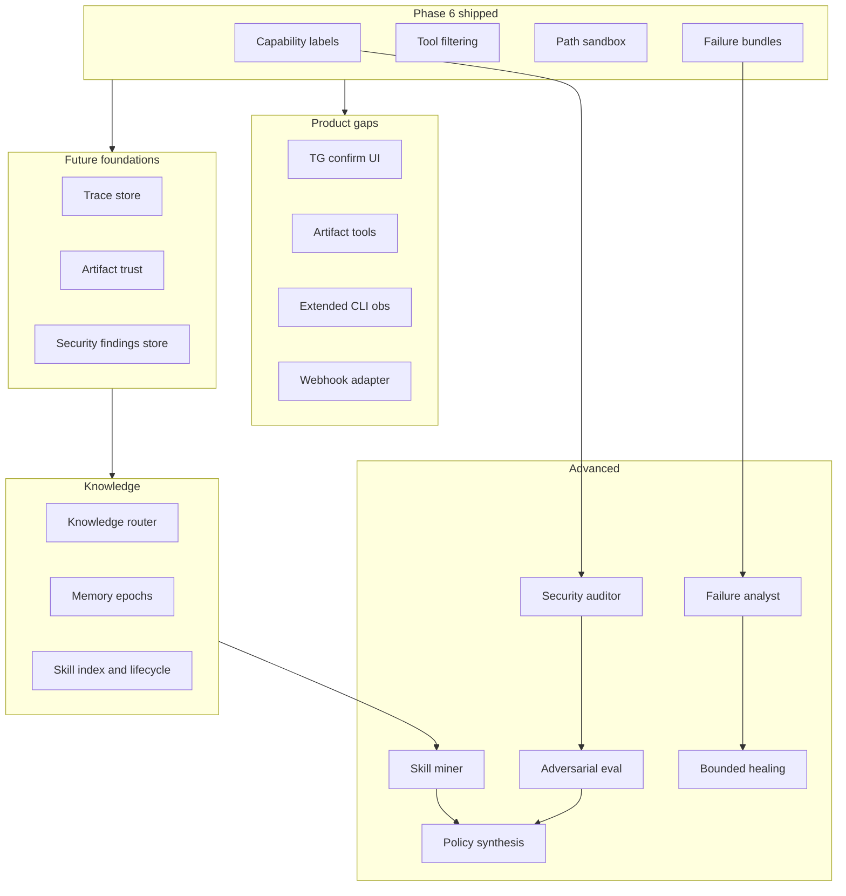

# Hestia — Deferred Work Roadmap (Post Phase 6)

**Purpose:** Single place for everything explicitly **not** in the Phase 6 pre-release hardening track, plus the larger “future systems” program. Use this for planning Kimi cycles after Phase 6 merges.

**Related sources:** (version in-repo if you want them tracked with git)

- `future-systems-design.md` — full subsystem spec (skills, failure analyst, security auditor, adversarial eval, phased F1–F6)
- `hestia-future-systems-synthesis.md` — knowledge separation, five-store model, memory epochs, consolidation-first compression
- [hestia-design-revised-april-2026.md](../design/hestia-design-revised-april-2026.md) (original phase map; some items superseded)
- [HANDOFF_STATE.md](../HANDOFF_STATE.md) (live design debt list)

---

## 1. Principles (carry forward)

These are non-negotiable constraints for all deferred work:

1. **Suggestions are cheap; trust is expensive.** Proposals may be automated; promotion into trusted behavior is gated.
2. **Improve policy before code.** Routing, tool exposure, compression, retry, and tests usually beat generated code changes.
3. **Observation can be continuous; mutation must be gated.**
4. **Large outputs are artifacts**, not prompt text (failure traces, security reports, skill drafts).
5. **Security is layered:** deterministic checks, policy, optional adversarial runs, human review for high-risk changes.
6. **Learning can be autonomous; trust cannot.**

---

## 2. Tier A — Product gaps (from HANDOFF + revised design)

These are user-visible or operator-visible gaps called out in repo docs but not shipped.

| ID | Item | Problem / intent | Suggested phase | Dependencies |
|----|------|------------------|-----------------|---------------|
| A1 | **Telegram confirmation UI** | Destructive tools (`terminal`, `write_file`) fail closed without `confirm_callback`. Operators need approve/deny without stdin. | Phase 7a | Inline keyboard in `python-telegram-bot`, map `msg_id` ↔ pending tool call |
| A2 | **Policy delegation UX** | When policy replaces a batch with one `delegate_task`, duplicate text for multiple `tool_call_id`s except the first. | Phase 7b | Orchestrator + model-facing tool result shaping |
| A3 | **Artifact inspection tools** | `read_artifact` exists; `grep_artifact`, `list_artifacts` called out as debt. Hard to work with large tool outputs. | Phase 7c | ArtifactStore listing + safe path/handle semantics |
| A4 | **CLI observability (extended)** | Phase 6 adds `status` / `version`; design doc also mentioned `logs`, `sessions`, `policy log`, `turn <id>`, `artifact <id>`. | Phase 7d | SessionStore queries, optional structured logging |
| A5 | **Webhook / generic HTTP adapter** | Home Assistant, cron POST, custom UIs without Telegram. | Phase 7e | New `Platform` impl, auth token, rate limits |
| A6 | **Example configs & recipes** | Weather monitor, RSS digest, HA bridge (from revised design Phase 6). | Docs + small scripts | Stable Telegram/Matrix + scheduler |
| A7 | **Read-only web dashboard (optional)** | ADR-007 defers full web UI; a **read-only** status view is still allowed as a future addition. | Phase 8+ | Separate process, no chat surface |
| A8 | **Vector / semantic memory (plugin)** | ADR-006 locks FTS for v1; semantic search remains an extension. | Plugin phase | `sqlite-vec` or external index, ADR |

---

## 3. Tier B — Future systems foundations (from future-systems-design “Phase F1”)

Phase 6 adds **capability labels**, **tool filtering**, and **failure bundles**. What remains from the original “F1 foundations” list:

| ID | Item | Description | Notes |
|----|------|-------------|--------|
| B1 | **Trace store** | Structured `TraceRecord` per unit of work (session, tools, outcome, artifact refs, token stats). | Builds on turns + messages; avoid duplicating full history |
| B2 | **Failure bundle enrichment** | Phase 6 bundles are minimal; extend with `failure_class` taxonomy depth, `policy_snapshot`, `slot_snapshot`, links to artifacts. | Align with future-systems §5.2 |
| B3 | **Artifact trust labels** | `trust`, `retention`, `redaction`, `producing_subsystem` on artifact metadata. | Extends `ArtifactMetadata` |
| B4 | **Security findings store** | Persist deterministic scan results (deps, config lint, capability audit). | Feeds “daily security audit” job |
| B5 | **Basic capability audit report** | CLI or scheduled job: list tools × capabilities × which sessions can invoke them. | Uses Phase 6 metadata |

---

## 4. Tier C — Knowledge architecture (from synthesis / “Phase S1–S3”)

Hermes-style **knowledge separation** adapted for Hestia. Explicitly deferred from Phase 6.

### 4.1 Five-store model (conceptual)

1. **Declarative** — stable facts (user, env, preferences).
2. **Procedural** — skills, macros, policy-skills.
3. **Episodic** — sessions, traces, tool chains, failure bundles, scheduled runs.
4. **Identity** — operator-owned constitution (tone, non-goals, local-first values); **not** the same as security policy.
5. **Artifacts / evidence** — large or sensitive blobs with provenance; never casually injected into prompt.

### 4.2 Subsystems (roadmap)

| Phase | Name | Deliverables |
|-------|------|--------------|
| **S1** | Knowledge separation | Knowledge Router module (classify “what kind of knowledge is this?”); typed storage boundaries; **memory epochs** (compiled prompt views refresh at controlled boundaries, not every write). |
| **S2** | Declarative + identity | Structured declarative store → compiled bounded views (`compiled_user_view`, etc.); identity/constitution module separate from `system_prompt` churn. |
| **S3** | Procedural / skills | Skill index in prompt (name + one-liner + capability tier + trust state); load-on-demand bodies; promotion states (`draft` → `tested` → `trusted` → `deprecated` → `disabled`). |

### 4.3 Consolidation-first compression

Before aggressive context drop:

- Scan for declarative candidates, skill deltas, episodic markers, failure signals, security-relevant signals.
- Preserve artifact references.

**Depends on:** S1 router + artifact trust metadata (B3).

---

## 5. Tier D — Skill miner, failure analyst, healing (F2–F3 + synthesis §7–9)

| Phase | Name | Deliverables |
|-------|------|--------------|
| **D1** | Failure analyst | Cluster failure bundles; rank by recurrence; output **proposals** (tests, policy tweaks, clearer errors) — not auto-apply. |
| **D2** | Skill miner | Detect repeated tool sequences from traces; generate **draft** skill specs with provenance; estimate savings. |
| **D3** | Bounded auto-healing | Allowlisted auto-apply only (retry thresholds, compression bands, disabling flaky non-critical skills). **Forbidden:** core orchestrator edits, permission widening, secret handling. Staging + rollback metadata. |

**Depends on:** B1 traces, B2 rich failure bundles, S3 skill lifecycle for D2/D3.

---

## 6. Tier E — Security loop & adversarial (F4–F5)

| Phase | Name | Deliverables |
|-------|------|--------------|
| **E1** | Security auditor (deterministic) | Dependency/CVE ingest (optional), config lint, filesystem permission snapshots, capability map review, scheduler rule checks, secret hygiene heuristics. |
| **E2** | Suspicious tool-chain detection | Heuristics over trace data (e.g. `memory_write` after untrusted content). |
| **E3** | Adversarial evaluator | Sandboxed prompt-injection, policy bypass, persistence-poisoning scenarios; outputs as artifacts + regression test candidates. **Not** an offensive hacking mode. |

**Depends on:** B4 findings store, B1 traces, Phase 6 capability model.

---

## 7. Tier F — Policy synthesis (future-systems §11)

Generate **candidate policies** (tool exposure, delegation thresholds, artifact promotion, approval rules) as structured proposals, evaluated against replay traces and adversarial fixtures before any promotion.

**Depends on:** D1, E3, trace store.

---

## 8. Suggested sequencing (macro roadmap)

Visual dependency order (each block can be multiple Kimi cycles):

**Practical ordering:**

1. **After Phase 6:** Matrix adapter + integration harness (separate design doc), Telegram confirmations (A1), artifact tools (A3).
2. **Then:** Trace store (B1) + enrich failure bundles (B2) — unlocks analyst and miner.
3. **Parallel track:** Security findings store (B4) + daily audit job (E1 light).
4. **Then:** Knowledge router + epochs (S1) before heavy consolidation-on-compress.
5. **Then:** Skill miner (D2) + failure analyst (D1); healing (D3) only with strict allowlists.
6. **Last:** Full adversarial harness (E3) and policy synthesis (F).

---

## 9. Explicit non-goals (do not slip in as “quick wins”)

- Unbounded self-modification of orchestrator core or approval gates.
- Community skill packs installed by default.
- Replacing deterministic security checks with “the model said it’s fine.”
- Cloud identity or multi-tenant isolation (stay local-first unless ADR changes).

---

## 10. Documentation hygiene

When a deferred item ships:

- Add or update an ADR in `docs/DECISIONS.md`.
- Trim this file or move completed rows to a “Done” appendix so the roadmap stays scannable.
- Keep `HANDOFF_STATE.md` design debt in sync (short list); this file holds the long-form roadmap.

---

**End of document**
